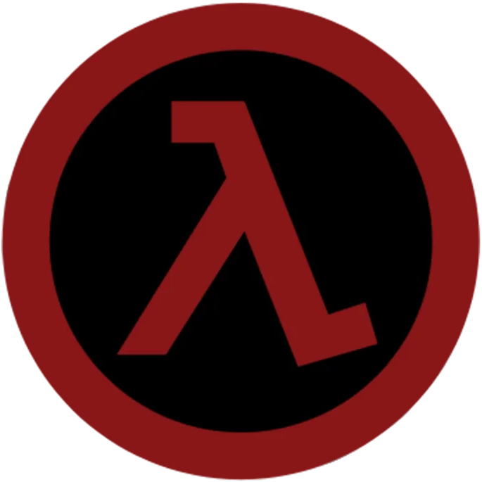

# Awesome Source Mods

A curated list of Source(or GoldSRC\*) mods.

\* Some GoldSRC mods are standalone [Xash3D](//moddb.com/engines/xash3d-engine) games

## Contents

> * [Action](#action)
> * [Horror](#horror)
> * [Half-Life Universe](#half-life-universe)
> * [Multiplayer](#multiplayer)
>   * [Death-Match](#death-match)
>   * [Co-Op](#co-op) 

## Action

*  [TimeWarp](//moddb.com/mods/timewarp) - A cartoon-styled standalone total-conversion mod for Half-Life.
*  [Underhell](//moddb.com/mods/underhell) - An action horror-themed mod based, with a long campaign.

## Horror

*  [eXperiment](//moddb.com/mods/experiment)

## Half-Life Universe

## Multiplayer

The below may also be "addons" for [Sven Co-Op](//steampowered.com/app/225840).

### Death-Match

### Co-Op
